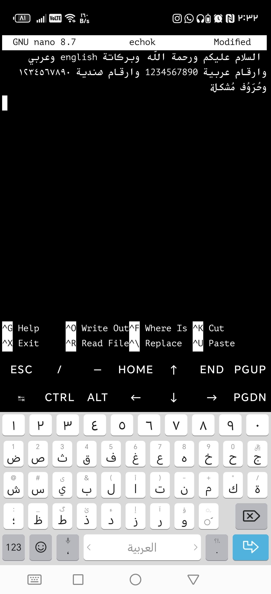

# دعم اللغة العربية في Termux - Arabic Support for Termux

> **📖 للاطلاع على توثيق Termux الأصلي | For original Termux documentation:** [README_TERMUX_ORIGINAL.md](README_TERMUX_ORIGINAL.md)

---

## نظرة عامة | Overview

هذا المشروع عبارة عن نسخة معدلة من Termux تدعم عرض اللغة العربية واللغات الأخرى التي تُكتب من اليمين إلى اليسار (RTL) بشكل صحيح في الطرفية.

This is a modified version of Termux that properly supports Arabic and other right-to-left (RTL) languages in the terminal.

**Based on:** [Termux](https://github.com/termux/termux-app) - Official Termux Android Application

### 📸 معاينة | Preview

<p align="center">
  
</p>

<p align="center">
  <em>دعم كامل للعربية مع ربط الحروف واتجاه RTL | Full Arabic support with character joining and RTL direction</em>
</p>

---

## المزايا | Features

### ✨ دعم كامل للعربية | Full Arabic Support

- **ربط الحروف العربية** - الحروف تظهر متصلة بشكل صحيح
  - **Arabic Character Joining** - Characters properly connect based on context

- **الاتجاه من اليمين لليسار** - النص يظهر بالاتجاه الصحيح
  - **Right-to-Left Direction** - Text flows in the correct direction

- **التشكيل والحركات** - دعم الحركات العربية
  - **Diacritics Support** - Arabic vowel marks and combining characters

- **النصوص المختلطة** - دعم خلط العربية والإنجليزية في نفس السطر
  - **BiDi Text** - Mixed Arabic/English text on the same line

### ⚡ الأداء | Performance

- **مسار سريع للنصوص البسيطة** - النصوص الإنجليزية لا تتأثر بالأداء
  - **Fast Path for LTR** - English/ASCII text uses optimized rendering

- **كشف تلقائي** - يتم اكتشاف النصوص العربية تلقائياً
  - **Automatic Detection** - Arabic text is detected automatically

### 🎨 خط KawkabMono | KawkabMono Font

- **خط عربي احترافي** - خط KawkabMono مخصص للبرمجة والطرفية
  - **Professional Arabic Font** - KawkabMono designed for coding and terminal

- **جاهز للاستخدام** - مدمج في التطبيق ويعمل تلقائياً
  - **Ready to Use** - Embedded in app and works automatically

- **قابل للتخصيص** - يمكن استبداله بخط مخصص في `~/.termux/font.ttf`
  - **Customizable** - Can be replaced with custom font in `~/.termux/font.ttf`

## التقنيات المستخدمة | Technical Implementation

### 🏗️ المعمارية | Architecture

```
TerminalRenderer.java
├── BiDiTextHelper.java
│   ├── RTL Character Detection
│   ├── Text Direction Analysis
│   └── Arabic Character Recognition
│
└── ArabicTextShaper.java
    ├── Android StaticLayout Integration
    ├── HarfBuzz Text Shaping (via Android)
    └── BiDi Text Rendering
```

### 🔧 المكونات | Components

#### 1. BiDiTextHelper
كلاس مساعد للكشف عن النصوص العربية وتحديد اتجاهها.

Helper class for detecting Arabic text and determining direction.

**الوظائف الرئيسية | Main Functions:**
- `containsRtlCharacters()` - كشف الحروف العربية
- `getTextDirection()` - تحديد اتجاه النص
- `isArabicCharacter()` - التحقق من الحروف العربية
- `needsTextShaping()` - تحديد الحاجة للتشكيل

#### 2. ArabicTextShaper
كلاس لتشكيل النصوص العربية باستخدام HarfBuzz (عبر Android).

Class for shaping Arabic text using HarfBuzz (through Android).

**الوظائف الرئيسية | Main Functions:**
- `drawShapedText()` - رسم النص المشكّل
- `measureShapedText()` - قياس عرض النص
- `requiresShaping()` - التحقق من الحاجة للتشكيل

#### 3. TerminalRenderer (Modified)
المحرك الرئيسي المعدل لدعم العربية.

Main rendering engine modified for Arabic support.

**التعديلات | Modifications:**
- إضافة imports للكلاسات الجديدة
- خاصية `sEnableArabicSupport` للتحكم
- منطق الكشف التلقائي في `drawTextRun()`
- Methods للتحكم: `setArabicSupportEnabled()` / `isArabicSupportEnabled()`

## متطلبات النظام | System Requirements

- **Android**: 5.0 (API 21) أو أحدث | or higher
- **المساحة**: إضافية قليلة جداً | Minimal additional space
- **الأداء**: تأثير طفيف جداً على الأداء | Minimal performance impact

## كيفية البناء | How to Build

### 1. المتطلبات | Prerequisites

```bash
# Install Android SDK and NDK
# تثبيت Android SDK و NDK

export ANDROID_SDK_ROOT=/path/to/android-sdk
export ANDROID_NDK_ROOT=/path/to/android-ndk
```

### 2. البناء | Build

```bash
cd termux-app

# Download dependencies
# تحميل المتطلبات
./gradlew downloadBootstraps

# Build APK
# بناء التطبيق
./gradlew assembleDebug

# Or for release
# أو للنسخة النهائية
./gradlew assembleRelease
```

### 3. التثبيت | Installation

```bash
# Install on connected device
# التثبيت على الجهاز المتصل
adb install -r app/build/outputs/apk/debug/termux-app_*_universal.apk
```

## الاستخدام | Usage

### تفعيل/تعطيل الدعم | Enable/Disable Support

الدعم **مفعّل افتراضياً**. للتحكم برمجياً:

Support is **enabled by default**. To control programmatically:

```java
// Enable Arabic support
TerminalRenderer.setArabicSupportEnabled(true);

// Disable Arabic support
TerminalRenderer.setArabicSupportEnabled(false);

// Check status
boolean isEnabled = TerminalRenderer.isArabicSupportEnabled();
```

### اختبار الدعم | Testing Support

بعد التثبيت، يمكنك تجربة:

After installation, you can try:

```bash
# Test Arabic output
# اختبار العربية
echo "مرحباً بك في Termux"
echo "هذا اختبار للغة العربية"

# Test with nano editor
# اختبار مع محرر nano
nano test.txt
# اكتب نص عربي | Write Arabic text

# Test with vim
# اختبار مع vim
vim test.txt
# اكتب نص عربي | Write Arabic text
```

## الاختبارات | Testing

### اختبار الحروف | Character Test

```bash
# Test character joining
# اختبار ربط الحروف
echo "ابجد هوز حطي كلمن سعفص قرشت ثخذ ضظغ"
```

يجب أن ترى الحروف **متصلة** وليست منفصلة.

You should see characters **connected** not separated.

### اختبار الاتجاه | Direction Test

```bash
# Test RTL direction
# اختبار اتجاه RTL
echo "السلام عليكم 123"
```

يجب أن يبدأ النص من اليمين.

Text should start from the right.

### اختبار BiDi | BiDi Test

```bash
# Mixed Arabic and English
# خليط عربي وإنجليزي
echo "Welcome مرحباً Hello السلام"
```

## المشاكل المعروفة | Known Issues

### ⚠️ القيود الحالية | Current Limitations

1. **الخطوط**: بعض الخطوط قد لا تدعم العربية بشكل كامل
   - **Fonts**: Some fonts may not fully support Arabic

2. **الأداء**: قد يكون هناك تأخير طفيف جداً مع نصوص طويلة
   - **Performance**: Very slight delay possible with very long text

3. **التطبيقات**: بعض التطبيقات قد تحتاج تعديلات إضافية
   - **Applications**: Some apps may need additional modifications

### 🐛 الإبلاغ عن المشاكل | Bug Reports

إذا وجدت مشكلة، يرجى الإبلاغ عنها مع:
- إصدار Android
- نموذج من النص العربي المشكل
- لقطة شاشة إن أمكن

If you find an issue, please report with:
- Android version
- Sample Arabic text
- Screenshot if possible

## التطوير المستقبلي | Future Development


## الترخيص | License

**المشروع:** GPLv3 (مثل Termux الأصلي)
**خط KawkabMono:** SIL Open Font License v1.1 (OFL-1.1)

This project is licensed under GPLv3 like the original Termux.
KawkabMono font is licensed under SIL Open Font License v1.1 (OFL-1.1).

### KawkabMono Font License
Copyright (c) 2015, Abdullah Arif
Licensed under the SIL Open Font License, Version 1.1
See: https://github.com/aiaf/kawkab-mono

## الشكر والتقدير | Acknowledgments

- **Termux Team** - للمشروع الأصلي الرائع
- **HarfBuzz Team** - لمكتبة تشكيل النصوص المعقدة
- **Abdullah Arif** - لخط KawkabMono (مرخص تحت SIL OFL 1.1)

- **Termux Team** - For the amazing original project
- **HarfBuzz Team** - For the complex text shaping library
- **Abdullah Arif** - For KawkabMono font (licensed under SIL OFL 1.1)

## الروابط | Links

- [Termux Original](https://github.com/termux/termux-app)
- [HarfBuzz](https://harfbuzz.github.io/)
- [Unicode BiDi Algorithm](https://unicode.org/reports/tr9/)
- [KawkabMono Font](https://github.com/aiaf/kawkab-mono) - SIL OFL 1.1

---

**صُنع بـ ❤️ للمجتمع العربي | Made with ❤️ for the Arabic community**

تم التطوير بواسطة: Aldaghir

Developed by: Aldaghir

إصدار: 1.0.0 | Version: 1.0.0

تاريخ: 2025-11-23 | Date: 2025-11-23
